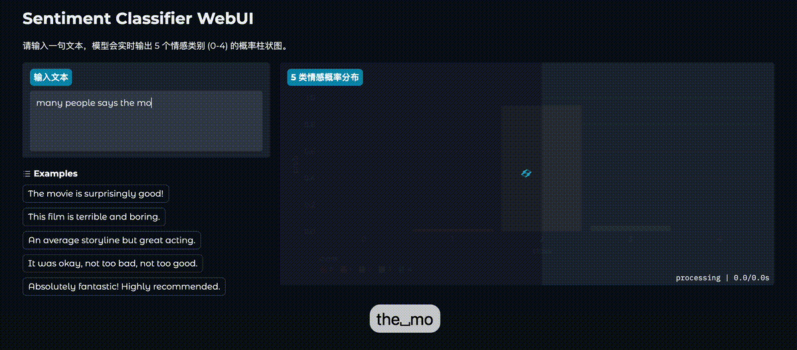

# ML Course (2025) Project: Analysis of Movie Sentiments

## 环境设置

```shell 
# install uv:
# curl -LsSf https://astral.sh/uv/install.sh | sh
uv sync
```

## 运行单元测试

```shell
uv run pytest
```

## 训练模型 (Classifier)

### usage
```shell
uv run scripts/train.py --help
```

### examples

TinyLLM:

```shell
size=small
reduction=mean
lr=5
name=tinyllm_${size}_reduction-${reduction}_lr${lr}e-5
uv run scripts/train.py \
    --wandb_run_name $name \
    --lr 0.0000${lr} \
    --epoch 3 \
    --save_ckpt $name.pt \
    --save_best_only \
    --batch_size 32 \
    --valid_interval 200 \
    tinyllm \
    --tokenizer tiny-stories \ # tokenizers in ckpt/tokenizer
    --reduction $reduction \
    --vocab_size 10000 \
    --model_size $size \
    --dropout $drop \
```

Fine-Tune checkpoints from `transformers`:
```shell
uv run scripts/train.py \
    --epoch 2 \
    --save_ckpt distilbert.pt \
    --save_best_only \
    transformers \
    --hf_model distilbert-base-uncased \
```

## 训练模型 (TinyLLM基模型)

### 已经训好的checkpoint

[README.md](ckpts/model/README.md)

### 训练

```shell
cd tinyllm/scripts
# train tokenizer
uv run bpe.py --help
# tokenize training data
uv run run_tokenizer.py --help
# train
uv run train.py --help
```

### 推理

```shell
cd tinyllm/scripts
uv run inference.py --help
```

### 集成进classifier

```shell
uv run scripts/train.py \
    tinyllm \
    --tokenizer tiny-stories \
    --vocab_size 10000 \
    --model_size size_of_checkpoint \
    --base_model path/to/checkpoint.pt
```

## WebUI

```shell
# example uses transformers, can be changed to tinyllm/lstm
uv run python -m app.webui.app \
    --load_ckpt path/to/checkpoint.pt \
    transformers \
    --some_train_args # e.g. --hf_model distilbert
```



## 报告

[Slide](docs/slide.pdf)

[Report](docs/report.pdf)